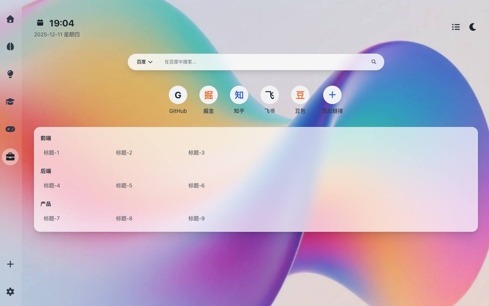

<p align="center">
  
</p>

# 千面书签

一个现代化的个人导航主页，提供主题切换、企业链接管理、书签分类、快捷链接、待办事项等功能。

## 项目特点

### 🎨 主题切换
- 支持明亮/暗黑模式
- 自动适配系统主题偏好
- 跨标签页主题同步

### 🏢 企业链接
- 集中管理企业内部系统
- 支持密码锁定保护
- 网格布局，一目了然

### 📚 书签管理
- 分类管理个人书签
- 支持隐藏/显示特定分类
- AI智能分类（预留功能）

### ⚡ 快捷链接
- 自定义常用网站入口

### ✅ 待办事项
- 集成待办事项面板
- 支持添加/删除/完成任务
- 本地数据持久化

### 🔍 搜索功能
- 支持多种搜索引擎切换
- 快速搜索入口

### 📅 日历集成
- 显示今日事件提醒

### 🖼️ 背景自定义
- 支持上传自定义背景图片
- 预设背景图片选择

## 千面书签｜使用文档



本文档介绍如何下载与启用扩展、在页面中使用书签过滤（按分类与单条链接）、以及可配置项与本地缓存说明。

---

## 1. 下载与启用

### 1.1 从 Chrome 商店安装（推荐）
上架后：
1. 打开 Chrome 网上应用店，搜索“千面书签”。
2. 点击“添加至 Chrome”。
3. 安装完成后，进入 chrome://extensions，确保扩展已启用，并（可选）固定到工具栏。


## 2. 启用与基础操作

- 新标签页：安装后默认替换浏览器新标签页（若未生效，请到 chrome://extensions 确认已启用）。
- 主题与背景：右上角设置图标进入“设置面板”，可切换明亮/暗黑、上传或重置背景。

  

- 侧边栏模式：
  - 常驻（always）：侧边栏一直显示。
  - 悬停（hover）：鼠标靠左侧时显示，离开后隐藏。

---

## 3. 书签过滤

### 3.1 按“分类”过滤（书签树）
1. 在左侧侧边栏，对任意“菜单项”右键，点击“书签显示管理”。

   

2. 在弹窗中：
   - 勾选 = 显示该分类；取消勾选 = 隐藏该分类。
   - 对父级分类操作会联动全部子分类。
   - “全部显示 / 全部隐藏”可一键操作当前标签页下所有分类。

   

3. 点击“保存设置”，页面将即时生效（无需刷新）。

说明：
- 该设置对“当前左- 侧菜单项”生效（每个菜单项有独立的隐藏配置）。
- 设置会持久化到本地（见下文“本地缓存键名”）。
- **重要**：除了手动隐藏，任何书签**文件夹**的名称如果包含 `hide` 关键字（不区分大小写），该文件夹及其所有内容将默认被隐藏，且不会出现在“书签显示管理”列表中。

### 3.2 单条链接过滤（隐藏单个书签）
1. 打开“设置面板” → 切换到“AI 书签管理”。
2. 在“404 链接检测”或“已隐藏的书签”区域：
   - 可对单条链接执行“隐藏/删除/恢复显示”操作。

说明：
- 当前版本单条链接管理入口在“设置面板 → AI 书签管理”。
- 该列表会根据你近期操作动态更新。

---

## 4. 快捷链接管理
- 首页中部显示“快捷链接”网格：
  - 点击“+”添加；右键单条链接可“修改/删除”。

    

  - 在设置面板可整体切换“显示/隐藏快捷链接”。
- 链接打开逻辑：
  - 自动补全协议（如不含 http/https，会默认以 https 打开）。

---

## 5. 企业链接工作台

企业链接功能允许你通过一个外部的 JSON 文件，批量导入公司或团队的常用链接，并在侧边栏生成一个专属的“公文包”图标入口。

### 5.1 使用方法
1.  **同步链接**：
    *   打开“设置”面板（右上角齿轮图标）。
    *   切换到“企业链接”页签。
    *   在输入框中填入你的 CDN 地址（一个可公开访问的 JSON 文件 URL）。
    *   点击“同步”。成功后，侧边栏会出现“公文包”图标。

    

2.  **访问与管理**：
    *   点击侧边栏的“公文包”图标，即可查看所有企业链接。
    *   右键点击“公文包”图标，可以对整个企业链接模块进行“锁定/解锁/删除”操作。

### 5.2 CDN 配置与 JSON 格式说明

CDN 地址必须是一个返回有效 JSON 数据的 URL。扩展支持以下几种常见的 JSON 格式，会自动解析：

#### 格式一：`companyArr` (推荐，支持分类)

这种格式允许你对链接进行分组。

-   **`companyArr`**: 一个数组，每个元素代表一个链接分类。
    -   `title`: `string` - 分类的标题。
    -   `children`: 一个数组，包含该分类下的所有链接。
        -   `title`: `string` - 链接的名称。
        -   `url`: `string` - 链接的地址。
-   **`companyImg`**: `string` (可选) - 公司的 Logo 或背景图 URL。如果提供，在选中“企业链接”时，将作为页面背景。

**示例：**
```json
{
  "companyArr": [
    {
      "title": "研发工具",
      "children": [
        { "title": "GitLab", "url": "https://gitlab.company.com" },
        { "title": "Jira", "url": "https://jira.company.com" }
      ]
    },
    {
      "title": "内部系统",
      "children": [
        { "title": "OA 系统", "url": "https://oa.company.com" },
        { "title": "HR 系统", "url": "https://hr.company.com" }
      ]
    }
  ],
  "companyImg": "https://example.com/company-background.png"
}
```

#### 格式二：`links` 数组 (扁平结构)

一个包含链接对象的扁平数组。

-   **`links`**: 一个数组，每个元素是一个链接对象。
    -   `name` 或 `title`: `string` - 链接名称。
    -   `url` 或 `link`: `string` - 链接地址。
    -   `icon`: `string` (可选) - Font Awesome 图标类名。
    -   `description`: `string` (可选) - 链接描述。

**示例：**
```json
{
  "links": [
    {
      "name": "企业门户",
      "url": "https://portal.company.com",
      "icon": "fa-building",
      "description": "公司官方门户"
    },
    {
      "title": "内部文档",
      "link": "https://docs.company.com",
      "icon": "fa-file-alt"
    }
  ]
}
```

#### 格式三：根级数组 (最简扁平结构)

直接一个链接对象数组。

-   `name` 或 `title`: `string` - 链接名称。
-   `url` 或 `link`: `string` - 链接地址。
-   `icon`: `string` (可选) - Font Awesome 图标类名。
-   `description`: `string` (可选) - 链接描述。

**示例：**
```json
[
  {
    "name": "项目管理",
    "url": "https://projects.company.com"
  },
  {
    "name": "团队协作",
    "url": "https://team.company.com"
  }
]
```

---


## 6. 常见操作速查
- 切换主题：右上角设置 → 主题模式开关
- 切换侧边栏模式：右上角设置 → 侧边栏设置（常驻/悬停）
- 切换快捷链接显示：右上角设置 → 快捷链接显示开关
- 书签分类隐藏/显示：左侧某菜单项右键 → 书签显示管理 → 勾选/取消
- 单条书签隐藏/恢复：设置 → AI 书签管理
- 企业链接：设置 → 企业链接 → 填写 CDN → 同步；侧边栏右键进行锁定/解锁/删除
